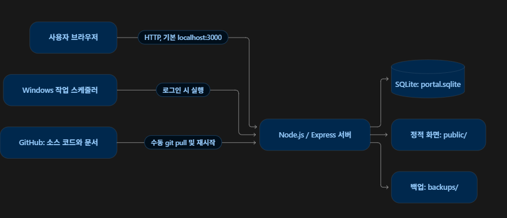

# DYKIM PORTAL 설계도

> 기준: 2026-10-05. 아래 기능은 현재 Windows 로컬 포털에 적용된 상태입니다. 이후 서버 코드를 바꾸면 예약 작업을 재시작해야 적용됩니다. 계획 중인 기능은 따로 표시합니다.

### 최근 변경 (2026-10-05)

- 자료 관리: 하위 폴더 들여쓰기·안내선 표시, 파일 끌어 놓기 등록(트리·목록의 폴더 지정).
- 좌우 분할 화면(자료 관리 폴더 트리, 자산 관리 분류, 업무관리 고객 목록): 경계를 끌어 왼쪽 영역 너비 조정.
- 모든 화면의 표: 머리글 경계를 끌어 열 너비 조정(두 번 누르면 기본 너비).
- 업로드: 파일당 500MB 제한 해제(모든 첨부), 대용량 업로드용 서버 요청 제한 시간 해제.
- 대시보드: 오늘의 할 일(미완료), 최근 프로젝트 3건, 관리자용 저장소 사용량 추가.
- 왼쪽·상단 메뉴에 **도구** 추가: draw.io·Claude·ChatGPT·Google Drive 바로가기를 이 화면에 모음(새 탭으로 열기).
- 자료 관리 이동·수정 창: 위치 목록 상자를 윈도우 탐색기 형태 폴더 선택기로 변경. 이동 창에는 지정한 Google Drive 폴더와 하위 폴더도 표시하며, 고르면 포털 자료를 유지한 채 복사.
- 자료 관리 상단 버튼은 **Drive 폴더**와 **자료 등록**만 남기고, 폴더 생성·폴더 업로드·폴더 이름 변경·폴더 이동은 우클릭 메뉴로만 제공.
- 자료 관리 우클릭 메뉴: 빈 곳·폴더·파일별로 상단 버튼 기능(폴더 생성·폴더 업로드·자료 등록·이름 변경·이동·Drive 복사·Drive 폴더 지정)과 열기·미리보기·다운로드·삭제를 표시. 조회자는 열람·다운로드·Drive 항목만.
- 자료 관리 → Google Drive 복사: 브라우저 파일 시스템 기능으로 Google Drive 데스크톱 폴더(G:\내 드라이브 안)에 파일·폴더를 복사(포털 자료 유지).
- 자료 관리 폴더째 업로드(끌어 놓기·폴더 업로드 버튼): 하위 폴더 구조 유지, 같은 이름 폴더 합치기, 같은 파일 건너뛰기.
- 대용량 업로드: 첨부 조각을 작은 트랜잭션으로 나누어 기록해 저장 중에도 서버가 응답하고, 큰 첨부 삭제는 백그라운드에서 정리. SQLite WAL 파일은 64MB(`journal_size_limit`)를 넘으면 정리 후 줄어듦.
- 메뉴: `기한 알림` → `알림`, 관리자용 **사용량 관리** 신설(왼쪽 하단 링크·상단 메뉴).
- 운영관리: **운영자 매뉴얼** 탭과 PDF 다운로드 추가, 문서의 굵게·코드·인용 표시.
- 사용자 관리·백업/복구: 왼쪽·상단 메뉴에서 빼고 **설정 → 관리자 메뉴**로 이동(해당 화면에서는 메뉴의 설정을 강조, 위치 표시는 `설정 / …`).

## 1. 목적과 범위

개인 PC 또는 사내 서버에서 설치 정보, 매뉴얼·자료, 자산, 고객별 업무일지와 알림을 한곳에서 관리하는 웹 포털입니다. 현재 사용 중인 Windows 설치는 사용자 PC에서 Node.js 서버를 백그라운드로 실행하고, 브라우저에서 http://localhost:3000 으로 접속합니다.

## 2. 전체 구성

- 화면: public/app.js, public/extras.js, public/management.js(프로젝트·운영관리·사용량 관리), public/navigation.js, public/notifications.js, public/styles.css. 별도 프런트엔드 빌드 없이 Express가 파일을 제공합니다.
- API·인증: server/app.mjs. 설치·자료는 server/features.mjs, 분류는 server/categories.mjs, 고객·업무일지는 server/work.mjs, 프로젝트는 server/projects.mjs, 운영 상태·문서와 운영자 매뉴얼 PDF는 server/operations.mjs·server/manual-pdf.mjs, 저장소 사용량은 server/usage.mjs, 대시보드 활동 정보는 server/activity.mjs, 리포트는 server/reports.mjs가 담당합니다.
- 저장소: server/db.mjs가 Node.js 내장 SQLite를 열고 기본 테이블을 만듭니다. 첨부파일은 SQLite의 BLOB 데이터로 저장합니다. 새 업로드는 메모리 사용을 줄이기 위해 작은 조각으로 나누어 저장하며, 기존 BLOB 첨부도 계속 읽습니다. Windows 기본 운영에 별도 SQLite 프로그램이나 Docker 설치는 필요하지 않습니다.
- 실행: server/index.mjs가 HTTP 서버와 1분 간격 기한 확인을 시작합니다. Windows 자동 실행에서는 server/windows-start.mjs가 로그를 파일에 기록하며 index.mjs를 불러옵니다.

## 3. 데이터 저장 위치

현재 Windows 설치의 프로젝트 경로는 F:\ChatGPT\DYKIM-PORTAL 입니다. .env에서 DATA_DIR을 바꾸지 않았다면 실제 저장 위치는 아래와 같습니다.

| 위치 | 저장 내용 | GitHub 전송 |
|---|---|---|
| F:\ChatGPT\DYKIM-PORTAL\data\portal.sqlite | 사용자, 설치·프로젝트·자료·자산·업무일지, 알림, 첨부파일과 새 파일 조각 등 운영 데이터 | 안 함 |
| 같은 data 폴더의 portal.sqlite-wal, portal.sqlite-shm | SQLite 실행 중 만들어질 수 있는 보조 파일 | 안 함 |
| F:\ChatGPT\DYKIM-PORTAL\data\upload-tmp\ | 업로드 중 사용하는 임시 파일. 완료 후 삭제 | 안 함 |
| F:\ChatGPT\DYKIM-PORTAL\data\server.log | Windows 백그라운드 서버 실행 기록 | 안 함 |
| F:\ChatGPT\DYKIM-PORTAL\data\setup-token.txt | 최초 관리자 생성 전의 일회용 설정 코드. 생성 후 삭제 | 안 함 |
| F:\ChatGPT\DYKIM-PORTAL\backups\ | npm run backup으로 만든 날짜별 SQLite 백업 | 안 함 |
| 브라우저 localStorage의 portal-theme | 해당 브라우저의 일반/다크 모드 선택 | 안 함 |
| 브라우저 localStorage의 portal-column-widths:*, portal-library-tree-width, portal-split-width:* | 표 열 너비와 좌우 분할 화면의 왼쪽 영역 너비(브라우저별) | 안 함 |

포털의 로그인 비밀번호는 원문이 아닌 scrypt 해시로 DB에 저장됩니다. 로그인 세션도 DB에 해시 형태로 저장하고, 브라우저에는 HttpOnly 세션 쿠키를 둡니다. 화면에서 내려받는 CSV는 요청 시 DB에서 만들어지며 별도 운영 파일로 쌓이지 않습니다.

로그인은 이메일 대신 고유한 `username` 아이디로 합니다. 기존 계정은 서버 업데이트 시 이메일의 `@` 앞부분을 아이디로 자동 지정하고, 중복되면 번호를 붙입니다. 이름·이메일·기존 비밀번호 해시와 기록은 유지합니다. 관리자는 사용자 관리에서 아이디를 확인하거나 변경할 수 있습니다.

.env가 존재하고 DATA_DIR을 다른 경로로 설정했다면 위 data 경로 대신 그 경로에 portal.sqlite 등이 저장됩니다. 데이터는 Git 저장소의 data/와 backups/ 제외 규칙에 따라 일반적인 git push로 GitHub에 올라가지 않습니다.

## 4. 데이터 모델

~~~mermaid
erDiagram
  users ||--o{ sessions : 로그인
  users ||--o{ items : 등록_수정
  items ||--o{ files : 첨부
  items ||--o{ history : 변경이력
  items ||--o{ notifications : 관리기한
  installations ||--o{ installation_files : 첨부
  installations |o--o{ projects : 연결
  projects ||--o{ project_tasks : 단계별_할일
  folders ||--o{ folders : 하위분류
  folders ||--o{ manuals : 자료
  record_categories ||--o{ record_categories : 하위분류
  customers ||--o{ work_logs : 업무일지
~~~

| 데이터 | 주요 내용 |
|---|---|
| users, sessions, login_attempts | 사용자 권한·로그인·시도 제한 |
| installations, installation_files | 고객사별 설치 현황과 건별 첨부자료 |
| projects, project_tasks | 설치·기타 프로젝트의 단계·상태·일정, 설치 정보 연결, 단계별 할 일 |
| record_categories | 자산의 대분류→중분류→소분류와 기존 설치 분류 이력. 새 설치 정보는 분류 없이 등록 |
| folders, manuals | 자료 관리의 단계 제한 없는 폴더 트리와 각 위치의 업로드 파일 |
| file_chunks | 새 첨부파일을 1MB 단위로 담는 공용 저장 테이블. scope와 file_id로 원본 기록을 식별 |
| items, files, history, notifications | 자산, 첨부파일, 변경 이력, 관리 기한 알림 |
| activity_events, activity_reads | 관리자용 변경·누락·월간 집계 알림과 사용자별 읽음 상태 |
| customers, work_logs | 고객 목록과 고객별 날짜·제목·업무 유형·업무 타입·담당자·상태·업무 내용 |

설치 기록의 고객사는 installations.customer에 이름으로 저장되며, 같은 이름을 업무관리의 customers 목록에도 추가합니다. 설치 기록 자체가 고객 ID를 참조하는 구조는 아닙니다. 설치 목록의 구분은 저장된 별도 분류값이 아니라 화면의 행 번호입니다. 설치시작일은 필수이고 설치종료일은 진행 중이면 비울 수 있습니다.

## 5. 화면과 주요 흐름

| 메뉴 | 사용자 흐름 |
|---|---|
| 대시보드 | 설치·자료·자산·읽지 않은 알림 건수, 로그인 사용자의 미완료 오늘의 할 일, 최근 프로젝트 3건, 최근 일주일 업무일지, 설치시작일이 최신인 설치 정보, 최근 수정한 자산 확인 |
| 설치관리 | **설치 정보 등록** → 고객사·제품명·세부내용·수량·설치시작/종료일·담당자·설치엔지니어·비고 입력 → 검색·상세·첨부·삭제 |
| 프로젝트 관리 | 설치·기타 프로젝트 등록 → 설치 전·중·후 단계와 상태, 예정·실제 일정, 담당자·위치·메모 관리 → 단계별 할 일 완료 및 설치 정보 연결 |
| 자료 관리 | 전체 자료 또는 선택한 폴더에서 폴더 생성·자료 등록(버튼 또는 파일 끌어 놓기) → 폴더를 우클릭해 하위 폴더 생성 → 폴더·자료 수정과 이동 → 검색·미리보기·다운로드·삭제. 폴더 트리 너비와 표 열 너비를 마우스로 조정 |
| 자산 관리 | 자산 분류 선택 → 일반/IT 자산 등록 → 상태·수량·담당자·관리 기한·첨부·변경 이력 관리·삭제 |
| TO-DO List | 개인별 오늘의 할 일을 스티커 메모로 작성·자동 저장·완료 보드 이동·삭제 |
| 업무관리 | 고객을 선택해 업무 유형과 업무 타입을 각각 지정한 업무일지를 작성·관리 |
| 도구 | draw.io(https://app.diagrams.net/)·Claude(https://claude.ai/)·ChatGPT(https://chatgpt.com/)·Google Drive(https://drive.google.com/)·Notion(https://www.notion.so/) 바로가기 카드와, 이 PC에 설치된 Visual Studio Code(`vscode://`)·DBeaver(`dbeaver-launch://`, 포털용으로 사용자 레지스트리에 등록한 실행 주소) 실행 카드, 이 PC에 설치된 Obsidian 앱을 `obsidian://open` 주소로 실행하는 카드(새 탭 없이 앱 실행, 처음에 브라우저가 앱 열기 허용을 물음). 누르면 새 탭에서 열리며 포털은 해당 서비스에 로그인하거나 파일을 저장하지 않습니다. 인터넷 연결과 각 서비스 계정이 필요합니다 |
| 리포트 | 기간별 설치·자료·자산·업무 현황 조회 → Excel에서 열 수 있는 UTF-8 CSV 다운로드 |
| 사용자 관리 | 관리자가 계정과 권한 관리 (설정 → 관리자 메뉴에서 이동) |
| 백업/복구 | 관리자가 온라인 백업 생성·목록·다운로드 및 선택한 시점 복구 (설정 → 관리자 메뉴에서 이동) |
| 사용량 관리 | 관리자가 로컬 드라이브 전체·여유 공간, DB·WAL·SHM·업로드 임시 폴더·실행 로그·백업 폴더 크기, 메뉴별 첨부파일 수와 용량 확인 |
| 운영관리 | 관리자가 서버 실행 상태·기본 건수 확인, 설계도·화면 디자인·운영자 매뉴얼 열람, 운영자 매뉴얼 PDF 다운로드 |
| 설정 | 관리자 메뉴(사용자 관리·백업/복구 바로가기, 관리자만), 일반/다크 모드, 왼쪽 메뉴 순서 편집 및 비밀번호 변경 |

세로 메뉴와 가로 메뉴는 같은 주요 화면 목록을 표시하며 현재 화면을 함께 강조합니다. **설정 → 메뉴 순서 편집**에서 위·아래 버튼으로 왼쪽 메뉴 순서를 변경하거나 기본 순서로 되돌릴 수 있습니다. 순서는 사용자 ID별 브라우저 저장소에 유지하고, 삭제되거나 권한이 없는 메뉴는 적용하지 않으며 새 메뉴는 뒤에 추가합니다. 관리자용 **운영관리**와 **사용량 관리**는 왼쪽 메뉴 하단의 **GitHub 저장소** 아래에 링크 형태로 차례로 두고(메뉴 순서 편집 대상 아님) 상단 가로 메뉴에서도 접근할 수 있습니다. 상단 **뒤로가기**는 방문한 화면 기록에서 직전 화면으로 이동합니다. 좁은 화면에서는 상단 가로 메뉴를 스크롤해 이용합니다. 화면 디자인 기준은 [화면 디자인 문서](PORTAL_UI_DESIGN.md)에 정리합니다.

**알림** 화면(2026-10-05 `기한 알림`에서 이름 변경)은 자산의 관리 기한과 관리자용 업무 활동을 함께 보여 줍니다. 각 알림에는 종류·제목·설명·시각·읽음 상태를 표시합니다. 자산 기한에는 해당 물품을 여는 버튼을, 업무 활동에는 관련 메뉴로 이동하는 버튼을 제공합니다. 알림의 읽음 버튼은 해당 알림 한 건만 처리합니다.

독립 메뉴 **TO-DO List**의 **오늘의 할 일**은 로그인 사용자별 메모입니다. 빈 공간을 우클릭하면 메모지가 만들어지고 노란 메모지 한 칸에 바로 글을 입력합니다. 입력 내용은 잠시 후와 포커스를 옮길 때 자동 저장되며 별도 제목 칸과 편집 버튼은 없습니다. 기존 제목·내용은 한 메모 칸에 합쳐 표시하고 첫 수정 시 한 본문으로 저장합니다. 메모지 오른쪽 아래 가장자리를 끌어 가로·세로 크기를 조절할 수 있으며 크기는 사용자별 브라우저에 저장됩니다. 날짜의 기본값은 한국 기준 오늘이며, 날짜가 지나도 메모는 남습니다. 완료 체크하면 오른쪽 **완료 보드**로 이동해 작은 메모로 붙고, 작은 메모를 누르면 큰 메모 보기에서 본문과 첨부를 확인할 수 있습니다. 큰 보기에서는 완료를 해제해 왼쪽 할 일로 돌려보내거나 삭제할 수 있습니다. 넓은 화면의 완료 보드는 약 590×690px이며, 메모가 많으면 내부를 스크롤합니다. 좁은 화면에서는 완료 보드를 아래에 배치합니다. 왼쪽의 검색창과 빈 안내 상자는 표시하지 않아 메모를 놓을 공간을 확보합니다. 삭제와 파일 드래그 첨부를 제공하며 다른 계정의 메모와 첨부는 API에서 조회하거나 수정할 수 없습니다. 본문과 첨부는 SQLite의 `todos`·`todo_files` 및 파일 청크에 저장하고 백업에 포함합니다. 업무관리 화면은 업무일지만 표시합니다.

관리자에게는 건수 카드 바로 아래에 **저장소 사용량**을 표시합니다. 데이터 저장 드라이브의 사용률 막대(90% 이상 경고색)와 사용/전체/여유 용량, 포털 데이터·첨부파일·백업 폴더 합계를 `/api/usage`에서 읽어 보여 주고 **사용량 관리** 버튼으로 상세 화면에 이동합니다. 사용량 조회가 실패해도 나머지 대시보드는 표시하며, 편집자·조회자에게는 표시하지 않습니다. 대시보드의 그 다음 줄에는 **오늘의 할 일 · 미완료**와 **최근 프로젝트**를 표시합니다. 오늘의 할 일은 로그인 사용자 본인의 완료하지 않은 TO-DO 메모를 날짜 역순으로 최대 10건 보여 주고 전체 미완료 건수와 날짜 상태(지난 날짜·오늘·예정)를 함께 표시하며, 누르면 TO-DO List로 이동합니다. 최근 프로젝트는 수정 시각(`updated_at`)이 최신인 프로젝트 3건을 고객사·유형·예정 기간·단계·상태와 함께 보여 주고, 누르면 프로젝트 상세 창을 엽니다. 그 아래 기존 목록은 유지합니다. **최근 일주일 업무관리**는 한국 날짜 기준 최근 7일의 업무일지를 업무일 역순으로 최대 7건 표시합니다. 항목을 누르면 해당 업무일지로 이동합니다. **최근 설치 정보**는 수정 시각이 아니라 설치시작일(`installed_on`)이 최신인 순서로 최대 5건 표시합니다. 자산의 관리 기한은 상단 **알림**에서 확인합니다.

설치 표는 **구분·고객사·제품명·세부내용·수량·설치시작일·설치종료일·담당자·설치엔지니어·비고**의 10개 열로 표시합니다. 구분은 화면의 행 번호이며, 제품명은 DB의 `name`, 세부내용은 `product_version` 필드에 대응합니다. 기존 기록은 삭제하지 않고 수량 기본값 1, 빈 설치종료일·담당자를 추가하는 방식으로 확장했습니다. 상태와 설치 위치는 상세 화면에서 계속 관리합니다. 과거 설치 분류는 데이터에 보존하지만 설치관리 화면에서 선택·표시하지 않습니다.

설치 표는 작은 글씨와 좁은 셀 간격을 사용합니다. 비고는 줄바꿈으로 전체 내용을 표시하며, 좁은 화면에서는 표를 가로로 스크롤할 수 있습니다. 고객사·제품명·세부내용을 누르면 해당 설치정보의 상세·수정 창이 열립니다. 모든 화면과 대화창의 표는 머리글 오른쪽 경계를 마우스로 끌어 열 너비를 조정할 수 있습니다(최소 60px, 키보드 좌우 화살표 10px). 표를 그린 뒤 자동으로 경계를 붙이므로 새 표에도 적용되며, 너비는 화면과 표 순서별로 브라우저 저장소(`portal-column-widths:<화면>:<순서>`, 자료 관리는 `portal-column-widths:library`)에 보관합니다. 넓히면 표 영역을 가로로 스크롤하고 좁혀서 남는 공간은 마지막 열이 채우며, 칸보다 긴 내용은 잘라 표시합니다. 경계를 두 번 누르면 그 표의 기본 너비로 돌아가고, 경계 조작은 정렬을 바꾸지 않습니다. 설치·자료·자산·업무일지·사용자 목록은 열 제목을 눌러 오름차순·내림차순 정렬하고 페이지당 25·50·70·100건을 선택할 수 있습니다. 서버는 허용된 정렬 열만 사용하며 정렬과 페이지 이동은 전체 검색 결과에 적용합니다. 업무일지의 업무 내용 입력칸은 세로로 크기를 조절할 수 있습니다.

수정 권한이 있는 사용자는 업무관리의 고객·업무일지, 설치정보, 자산·자산 분류, 자료 폴더·파일, 사용자 목록의 항목을 우클릭해 수정·삭제 메뉴를 열 수 있습니다. 대시보드와 알림에 표시되는 설치정보·자산에도 같은 동작을 적용합니다. 메뉴는 기존 수정·삭제 기능을 호출하므로 서버 권한 검사, 삭제 확인, 연결 기록 보존 정책을 그대로 따릅니다. 본인 계정에는 삭제 항목을 표시하지 않습니다.

우클릭 메뉴의 삭제는 즉시 실행하지 않고 해당 종류의 목록을 다중 선택 상태로 전환합니다. 항목별 체크박스와 현재 목록 전체 선택을 제공하며 선택 ID는 페이지 이동 중 브라우저 메모리에 유지합니다. 최종 삭제는 한 번 확인을 받은 뒤 기존 개별 삭제 API를 순서대로 호출합니다. 부모·자식 분류를 함께 선택한 경우 자식을 먼저 처리합니다. 일부 요청이 실패하면 성공·실패 건수를 구분해 알리고 실패 항목은 선택 상태로 남겨 재시도하거나 취소할 수 있습니다. 실제 삭제 전까지 DB 내용은 변경되지 않습니다.

업무일지의 **업무 유형**(`work_type`)은 정기점검·장애지원·설치·Per Call·기타이며, 별도 항목인 **업무 타입**(`work_mode`)은 원격·방문·기타입니다. 작성·수정 창에는 두 선택 항목이 따로 있고, 새 업무일지는 각각 선택해야 저장됩니다. 목록에도 두 열을 따로 표시하며 필터·정렬과 CSV 출력에 각각 반영합니다. 기존 업무일지의 업무 타입은 임의로 추정하지 않고 `NULL`로 보존해 **미분류**로 표시합니다. 이전 버전에서 업무 유형으로 입력된 원격·방문은 업무 타입으로 옮기고, 당시의 업무 유형은 알 수 없으므로 미분류로 표시합니다. 기존 고객·제목·날짜·내용은 유지됩니다.

업무관리 왼쪽에서 고객을 선택하면 저장된 고객 메모·연락처를 업무일지 위에 표시합니다. 해당 고객 정보 영역에 파일을 끌어 놓으면 첨부되며 목록에서 내려받거나 권한이 있는 사용자가 삭제할 수 있습니다. 고객 첨부는 `customer_files`와 파일 청크에 저장합니다. 자료 관리에서는 전체 자료와 모든 폴더의 자료 목록에 파일을 끌어 놓아 등록할 수 있습니다. 왼쪽 트리나 목록의 폴더 행에 놓으면 그 폴더에, 그 밖의 자료 영역에 놓으면 현재 폴더에 등록하고 등록한 폴더를 엽니다. PC의 폴더를 끌어 놓거나 **폴더 업로드**(폴더 선택 창)로 고르면 하위 폴더 구조를 그대로 만들고 각 파일을 해당 폴더에 등록합니다(2026-10-05). 같은 위치에 같은 이름의 폴더가 있으면 그 폴더에 합치고, 이름·크기가 같은 파일은 건너뛰며, 끌어 놓기로는 빈 폴더도 만듭니다. 결과는 만든 폴더·등록·건너뜀·실패 건수로 알리며, 등록 영역 밖에 놓은 파일은 브라우저가 열지 않도록 막습니다. 파일 크기 제한은 없으며 여러 파일도 순서대로 등록합니다.

삭제는 관리자·편집자만 할 수 있습니다. 설치정보와 자산을 삭제하면 해당 첨부자료도 함께 삭제됩니다. 업무일지와 자료 파일도 개별 삭제할 수 있고, 자료 폴더와 자산 분류는 비어 있을 때만 삭제할 수 있습니다. 고객을 삭제할 때 연결된 설치정보나 업무일지가 있으면 기록은 보존하고 고객을 비활성화하여 고객 목록에서 숨깁니다. 연결 기록이 없는 고객은 완전히 삭제합니다. 사용자 계정은 본인 계정이 아니고 작성·수정 이력이 없을 때만 삭제할 수 있으며, 이력이 있는 계정은 비활성화합니다. 삭제 후 복구가 필요하면 삭제 전 데이터 백업에서 복원해야 합니다.

설치 정보를 새로 저장할 때는 **저장 중** 상태를 보여 주고, 저장이 끝나면 첨부자료를 추가할 수 있는 상세 창에 완료 안내를 표시합니다. 기존 기록 수정이 끝나면 상세 창을 닫고 목록 및 완료 안내를 보여 줍니다. 저장 요청이 실패하면 오류를 저장 버튼 근처에 표시합니다. 따라서 저장 여부를 확인하기 위해 같은 버튼을 반복해서 누를 필요가 없습니다.

자료 관리는 단계 이름이나 깊이 제한 없이 폴더를 중첩합니다. 왼쪽 폴더 트리는 탐색기처럼 작은 노란 폴더 아이콘과 촘촘한 행, 깊이에 따른 들여쓰기, 펼침·접기 화살표로 표시합니다. 폴더 이름을 누르면 해당 위치로 이동하고 화살표를 누르면 그 폴더의 하위 목록만 펼치거나 접습니다. 상단 **폴더 생성**은 현재 위치에 폴더를 만들고, 자료 영역의 빈 공간을 우클릭해도 같은 위치에 만들 수 있습니다. 폴더 행이나 왼쪽 트리의 폴더를 우클릭하면 그 폴더 아래에 하위 폴더를 만들 수 있으며, 하위 폴더에서도 같은 작업을 반복할 수 있습니다. 자료는 전체 자료와 모든 폴더에 등록할 수 있습니다. 서버 시작 시 계층을 합치지 않으며 과거에 이미 이름이 ` · `로 합쳐진 폴더도 기존 이름·ID·자료 연결을 유지합니다. 관리자와 편집자는 폴더명, 자료명, 소속 폴더를 바꿀 수 있고 조회자는 열람만 할 수 있습니다. 자료 파일은 다른 폴더 또는 전체 자료로 옮길 수 있으며 파일 이름·본문·미리보기 데이터는 변경하지 않습니다. 자료명 수정 시 파일 확장자는 유지하며 파일 본문은 변경하지 않습니다.

왼쪽 폴더 트리와 자료 목록 사이의 경계를 마우스로 끌면 폴더 트리 너비를 140px부터 자료 목록이 360px 남을 때까지 조정할 수 있습니다(키보드 좌우 화살표 10px). 너비는 브라우저 저장소(`portal-library-tree-width`)에 보관하고 경계를 두 번 누르면 기본 200px로 돌아가며, 좁은 화면(720px 이하)에서는 경계를 숨깁니다. 자료 목록 표는 머리글 오른쪽 경계를 마우스로 끌어 열 너비를 조정합니다(최소 60px, 키보드 좌우 화살표로도 10px씩 조정). 넓히면 표 영역을 가로로 스크롤하고, 좁혀서 남는 공간은 마지막 관리 열이 채웁니다. 너비는 브라우저 저장소(`portal-column-widths:library`)에 보관하며 경계를 두 번 누르면 기본 너비로 돌아갑니다. 경계 조작은 정렬을 바꾸지 않습니다.

**Google Drive 복사**는 서버가 아니라 브라우저가 처리합니다. 포털 서버는 S4U 예약 작업으로 실행되어 사용자 세션의 Google Drive 가상 드라이브(G:)를 쓸 수 없기 때문입니다. 사용자가 **Drive 폴더 지정**으로 `G:\내 드라이브` 안 폴더를 고르면 브라우저(Chrome·Edge의 `showDirectoryPicker`)가 폴더 핸들을 IndexedDB(`portal-drive`)에 기억하고, 파일 행·폴더 행의 **Drive** 버튼은 포털 다운로드를 스트림으로 받아 그 폴더에 저장합니다. 폴더는 하위 구조를 유지하며, 같은 이름·크기 파일은 건너뛰고 크기가 다르면 `이름 (2)`로 저장합니다. Windows에서 쓸 수 없는 문자는 `_`로 바꿉니다. 포털 자료는 삭제하지 않으며, 클라우드 업로드는 Google Drive 앱의 동기화에 맡깁니다. 조회자도 다운로드 권한이 있으므로 사용할 수 있습니다.

폴더 이동·자료 이동·자료 수정 창의 위치 선택은 목록 상자 대신 **윈도우 탐색기 형태의 폴더 선택기**를 씁니다. 왼쪽 폴더 트리와 같은 순서·들여쓰기·안내선·펼침/접기 화살표·노란 폴더 아이콘으로 표시하고, 현재 위치와 이동할 폴더 자신은 표시만 하고 고를 수 없게 하며(이동할 폴더의 하위는 숨김), 아래에 선택한 경로를 보여 줍니다. 위치를 고르지 않고 이동하면 창 안에 오류를 표시합니다.

폴더 자체도 다른 폴더 또는 전체 자료 아래로 이동할 수 있습니다. 연결된 하위 폴더와 파일은 기존 ID를 유지한 채 함께 따라갑니다. 자기 자신이나 자신의 하위 폴더로 이동할 수 없으며, 이동할 위치에 같은 이름의 폴더가 있으면 저장하지 않습니다.

프로젝트는 설치 기록과 별도 테이블에 보관하며 기존 설치 정보를 선택적으로 연결할 수 있습니다. 설치 프로젝트를 등록할 때 설치 전·중·후의 기본 할 일을 만들고, 필요에 따라 추가하거나 완료 처리합니다. 프로젝트 저장이 성공하면 대화창을 닫고 갱신된 목록을 보여 줍니다. 단계별 할 일은 목록에서 프로젝트를 다시 열어 관리합니다. 관리자와 편집자에게는 목록의 각 프로젝트 오른쪽에도 **삭제** 버튼을 표시하며, 삭제 전에 확인을 받습니다. 프로젝트를 삭제하면 해당 프로젝트의 할 일만 삭제되며 연결된 설치 기록은 유지합니다.

운영관리는 관리자 전용입니다. 서버 시작 시각·가동 시간과 활성 사용자, 설치·프로젝트·자료·업무일지 건수를 보여 줍니다. 설계도(`docs/PORTAL_DESIGN.md`)와 화면 디자인(`docs/PORTAL_UI_DESIGN.md`)은 요청할 때 파일에서 읽어 화면에 표시합니다. 따라서 두 문서의 텍스트 수정은 서버 재시작 없이 운영관리 화면을 다시 열면 반영됩니다. 백업·복구 작업은 별도 메뉴에서 진행합니다. **운영자 매뉴얼**(`docs/OPERATOR_MANUAL.md`) 탭은 사용법·서비스 기동·백업/복구·업데이트·장애 대응 절차를 보여 주고, **PDF 다운로드**(`/api/operations/manual.pdf`, 관리자 전용)는 요청할 때마다 매뉴얼 문서로 PDF를 만들어 `DYKIM-PORTAL-Operator-Manual.pdf`로 내려 줍니다. PDF는 서버 PC의 한글 글꼴(Windows는 맑은 고딕 `C:\Windows\Fonts\malgun.ttf`, 필요하면 `PDF_FONT` 환경 변수로 지정)을 사용하며, 글꼴이 없으면 오류 안내를 반환합니다. 문서 화면은 굵게·코드·인용·링크를 표시하되 내용은 이스케이프해 HTML로 실행하지 않습니다.

## 6. 권한과 보안

- 관리자: 모든 업무 기능과 사용자 관리, 백업/복구, 사용량 관리, 운영관리.
- 편집자: 설치·프로젝트·자료·자산·고객·업무일지의 등록·수정과 자료 관리.
- 조회자: 조회·검색·다운로드·리포트 확인.
- 서버에서 역할을 검사하며, 쓰기 요청은 설정된 APP_ORIGIN과 요청 헤더를 확인합니다. 세션 쿠키는 HttpOnly·SameSite이며 기본 유효 시간은 12시간입니다.
- 기본 설정은 127.0.0.1:3000에서만 수신합니다. 사내 다른 기기나 인터넷에서 접속시키려면 네트워크·HTTPS·접속 주소를 별도로 구성해야 합니다.

## 7. 파일·알림·운영 제한

- 자료 관리·설치·자산·고객·TO-DO 첨부 모두 파일 크기 제한이 없습니다(2026-10-05 500MB 제한 해제). 디스크 여유 공간이 실제 한도이며, 대용량 업로드가 끊기지 않도록 Node 서버의 요청 제한 시간(기본 5분)도 해제했습니다. 큰 파일은 업로드가 끝난 뒤 8MB씩 나누어 데이터베이스에 기록하며 그 사이 다른 요청을 처리하므로 기록 중에도 포털을 계속 사용할 수 있습니다. 기록이 모두 끝나야 목록에 나타나고, 큰 파일 삭제도 기록을 먼저 지운 뒤 백그라운드에서 나누어 정리합니다(2026-10-05 개선). 서버가 도중에 꺼져 기록 없이 남은 조각은 다음 시작 때 정리합니다. 업로드는 `data/upload-tmp/`에 임시 저장한 뒤 SQLite의 `file_chunks` 테이블에 1MB 단위로 기록합니다. 기존 첨부는 원래 BLOB에서 읽으며, 백업에는 두 형식 모두 포함됩니다.
- PDF, PNG, JPG, GIF, WebP, 텍스트 파일은 미리보기를 지원합니다. Office/HWP 등은 다운로드하여 확인합니다.
- 자산 관리 기한은 서버 시작 시와 실행 중 매분 한국 시간 기준으로 검사합니다. 알림은 포털 안에 표시되며 이메일·문자 발송은 구현되어 있지 않습니다.
- 현재 구조는 로컬 SQLite를 사용하는 단일 서버·소규모 공유 환경을 대상으로 합니다. PC 전원이 꺼지면 포털에도 접속할 수 없습니다.

\1
**안정화 구성(2026-10-05)**: 예약 작업이 실행하는 `server/windows-start.mjs`는 감독 프로세스로 동작하며, 실제 포털은 같은 파일의 `--worker` 작업 프로세스(내부에서 `index.mjs` 실행)로 띄웁니다. 작업 프로세스가 비정상 종료되면 2초부터 최대 30초 간격으로 다시 띄우고, 10분 안에 5번 넘게 멈추면 감독도 종료해 예약 작업의 재시작 설정(1분 간격 3회)에 맡깁니다. 둘은 ipc 채널로 연결되어 예약 작업을 끝내 감독이 강제 종료되면 작업 프로세스도 곧바로 종료해 포트 3000을 비웁니다. 작업 프로세스는 1분마다 DB를 읽어 보고 `disk I/O error` 같은 SQLite 오류가 3회 연속되면 종료해 새 연결로 다시 시작합니다. `/api/health`는 `database`(ok/error) 값을 함께 돌려줍니다. 로그 `data/server.log`는 5MB를 넘거나 예전 UTF-16 내용이 섞여 있으면 시작할 때 `server-날짜.log`로 넘기고 지난 로그는 5개까지 보관합니다. 사용자가 업로드를 취소해 끊긴 요청은 서버 오류로 기록하지 않습니다.

`scripts/windows-install.ps1`은 작업 스케줄러에 `DYKIM Personal Portal` 작업을 등록합니다. Windows 로그인 시 현재 사용자 권한으로 Node.js를 직접 실행하므로 평상시에는 명령 창을 열어 둘 필요가 없습니다. 작업은 프로젝트 폴더를 작업 디렉터리로 사용하며, 실행 기록은 `data/server.log`에 남깁니다. PC가 꺼져 있거나 해당 Windows 사용자가 로그인하지 않으면 기본 로컬 서버에 접속할 수 없습니다. 기동·재시작·포트 충돌·로그 확인 절차는 [운영 및 장애 대응 문서](OPERATIONS.md)에 있습니다.

`/api/health`의 `ok: true`는 웹 서버가 응답한다는 뜻이며 SQLite 연결까지 정상이라는 보장은 아닙니다. 로그인 화면에 **“처리 중 오류가 발생했습니다”**가 표시되면 HTTP 응답 코드와 `data/server.log`를 함께 확인합니다. 2026-10-05에는 서버가 응답하는 동안 SQLite `disk I/O error`로 로그인 API가 500을 반환했습니다. 운영 DB의 읽기 전용 무결성 검사와 검증된 온라인 백업을 마친 뒤 `DYKIM Personal Portal` 작업을 중지·재시작하여 정상 응답을 회복했습니다. 이 오류만으로 DB 손상이나 물리 디스크 고장을 단정하지 않으며, 원인 확인 전 운영 DB·WAL·SHM 파일을 수동으로 교체하거나 삭제하지 않습니다. 재시작 뒤에는 새 서버 인스턴스, DB 무결성, 로그인 API의 500 해소를 확인하고 실제 계정 로그인으로 마무리합니다. 자세한 순서는 [운영 및 장애 대응 문서](OPERATIONS.md)를 따릅니다.

관리자 전용 **백업/복구** 메뉴와 `npm run backup`은 실행 중인 SQLite의 온라인 백업을 backups/에 생성합니다. 메뉴에서 백업 시점·파일 크기를 조회하고 SQLite 파일을 내려받을 수 있습니다. 복구는 관리자만 할 수 있고, 목록에서 선택한 파일명을 다시 확인한 뒤 시작합니다. 서버는 파일명과 원본 백업의 SQLite 무결성·외래키·필수 테이블·관리자 계정 유무를 확인하고 새 요청을 막습니다. 현재 상태를 `portal-pre-restore-*.sqlite`로 먼저 백업합니다.

초기 버전처럼 고객·업무일지 테이블이 없는 **확인된 이전 포털 형식**은 원본을 그대로 둔 채 별도 임시 폴더에 복사합니다. 그 사본만 현재 스키마로 이전한 뒤, 현재 형식의 필수 테이블·무결성과 사용자·자산·첨부·설치·자료 등의 건수가 보존됐는지 다시 검사합니다. 이전 형식과 맞지 않거나 검사에 실패하면 현재 DB를 교체하지 않고 기존 서버를 다시 엽니다. 검증된 백업만 서버 연결과 SQLite를 닫은 후 현재 DB 파일을 별도 이름으로 보관하며 적용합니다. 새 서버가 같은 주소로 정상 기동하면 이전 DB 임시본을 지웁니다. 기동 실패 시 이전 DB를 되돌리고 복구 실패 상태를 알립니다. 선택한 시점 이후의 입력은 현재 데이터에서 사라지고 기존 로그인도 달라질 수 있습니다.

백업은 매일 자동으로 만듭니다(2026-10-05부터). 포털이 실행 중일 때 1분마다 확인해 마지막 일반 백업이 24시간보다 오래되면 백업하며, 드라이브 여유 공간이 DB 크기의 2배보다 작으면 건너뛰고 로그에 남깁니다(`.env`에 `AUTO_BACKUP=off`이면 끔). 백업의 무결성 검사는 별도 스레드에서 실행해 백업 중에도 포털이 응답합니다. 다른 디스크·외부 보관은 별도로 해야 합니다. `backups/`의 일반 백업과 `portal-pre-restore-*.sqlite`는 생성 시각부터 7일(168시간)간 보관하고 그 뒤 자동 삭제합니다. 파일명에 기록된 UTC 생성 시각을 기준으로 삼고, 날짜가 없는 이전 형식 파일은 마지막 수정 시각을 사용합니다. 포털 시작 시, 실행 중 매분, 백업 목록 조회·생성·복구 요청 시 기한을 검사합니다. PC가 꺼져 있던 동안 만료된 파일은 다음 실행 시 정리합니다. 다운로드·복구 중인 파일은 작업이 끝날 때까지 정리하지 않습니다. 명령줄 백업도 생성 후 만료 파일을 정리합니다. 이 정책은 설정된 `BACKUP_DIR` 안의 포털 백업 파일에 적용되며 다른 디스크에 따로 내려받은 사본에는 적용되지 않습니다. 장기 보관이 필요하면 만료 전에 별도 저장소로 복사해야 합니다. 큰 파일을 올리거나 큰 백업을 복구할 때는 임시 사본·SQLite/WAL·복구 직전 백업을 위한 추가 디스크 공간이 필요합니다. 지원하지 않는 다른 DB 형식이나 복구 실패 때는 [운영 문서](OPERATIONS.md)의 수동 절차를 확인합니다.

## 9. GitHub의 역할과 업데이트 흐름

[GitHub 저장소](https://github.com/dykim-tech/portal)는 **설계도와 프로그램 소스의 버전 관리·변경 검토·자동 검사**를 위한 곳입니다. GitHub Actions가 문법 검사, 자동 테스트, 의존성 보안 검사를 수행합니다. 현재 포털은 블로그처럼 GitHub에서 정적 페이지만 제공하는 구조가 아닙니다. 로그인·검색·파일 업로드·업무 데이터 저장을 담당하는 Node.js 서버가 로컬 PC에서 실행되며, GitHub는 그 서버나 SQLite 운영 데이터를 실시간으로 호스팅하지 않습니다.

~~~mermaid
flowchart LR
  C[코드·문서 수정] --> R[GitHub 저장소 / 검토]
  R --> A[자동 검사]
  A --> M[main 반영]
  M --> L[PC에서 git pull]
  L --> W[Windows 포털 작업 재설치·재시작]
  W --> P[새 버전 접속]
~~~

일반 사용 중 입력한 데이터는 PC의 SQLite에 즉시 저장됩니다. 코드 업데이트는 git pull과 서버 재시작을 해야 화면에 반영됩니다. .gitignore는 .env, data/, backups/, node_modules/ 및 로그를 제외합니다. 따라서 GitHub만으로는 운영 데이터 복구가 불가능하며 SQLite 백업을 별도로 보관해야 합니다.

Docker로 운영하는 경우에는 PC의 data 폴더 대신 Compose의 portal_data 볼륨에 DB가, portal_backups 볼륨에 백업이 저장됩니다.

## 10. PC 교체 시 이전

새 PC로 옮길 때는 **GitHub에서 프로그램을 받고, 기존 PC의 SQLite 백업을 별도로 옮기는 두 작업**이 필요합니다. 기존 PC에서 입력을 중지하고 예약 작업을 사용 안 함으로 설정한 뒤 `npm.cmd run backup`으로 최종 백업을 만듭니다. 새 PC에 Node.js 24.13 이상 24.x와 Git을 설치해 코드를 받은 다음, 포털을 시작하기 전에 백업을 새 `data/portal.sqlite`로 복원합니다. `.env`가 있다면 `DATA_DIR` 등 옛 PC 경로를 새 환경에 맞게 검토합니다.

복원 뒤 기존 관리자 계정으로 로그인하고 설치·자료·자산·업무일지 건수와 첨부파일을 확인합니다. 두 PC를 동시에 사용하면 데이터가 자동으로 합쳐지지 않습니다. 자세한 명령, 무결성 확인, 전환 실패 시 되돌리기는 [PC 이전 가이드](PC_MIGRATION.md)를 따릅니다. 백업 파일에는 업무 자료와 계정 해시가 포함되므로 공개 GitHub에 올리지 않습니다.

## 11. 모바일·외부 접속 계획

현재 기본 설정은 포털을 실행하는 **PC 자신의 `http://localhost:3000`**에서만 접속할 수 있습니다. 휴대폰의 `localhost`는 휴대폰 자신을 뜻하므로 현재 주소만으로는 접속할 수 없습니다. 집 안과 외부 모두에서 휴대폰으로 접속하는 요구는 확인했지만, 원격 접속 설정은 아직 진행하지 않았습니다. 추후 PC와 휴대폰에 Tailscale을 설치하고 인증된 HTTPS 주소, `APP_ORIGIN`, 로그인·접속 범위를 함께 점검하는 방식으로 계획합니다. 새 PC로 이전하면 그 접속 설정도 새 PC 기준으로 다시 확인해야 합니다.
